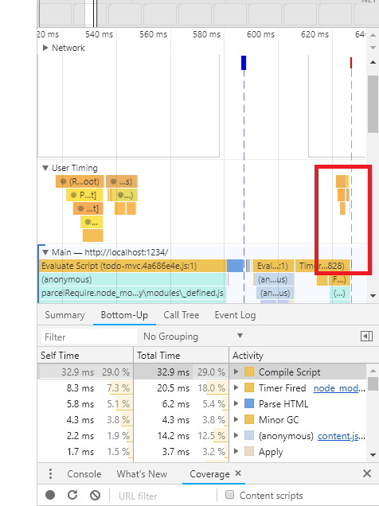

# The problem of Cascading Update

There was a great humor about `Subscribe.componentDidMount`:


If you use `BehaviorSubject`, it always show a red warning line in the debugger if you're meticulous. The fact that there was one line problem in `Subscribe.componentDidMount` that relevants to this problem (but i still keep it for some reasons we might discuss later):

```jsx
  componentDidMount() {
    this.subscription = this.observerListener
      .pipe(
        switchMap(observer => observer),
        distinctUntilChanged()
      )
      .subscribe(this.onStateChange)

    /**
     *  The controversal line i said:
     */
    this.observerListener.next(this.props.observer)
  }
```

To fix this, you might use `setTimeout` and `Subject` instead of `BehaviorSubject` in React Epic:

```jsx
const counterEpic = ({ counter$ }) => {
  setTimeout(() => {
    counter$.next(initialValue)
  }, 0)

  // Return an epic here
}
```

The warning will disappear. Instead, you will get one alternative rendering in the middle of DOM Content Loaded and Loaded event:



That means if the store state is distinguished from the `initialState` then alternative rendering is required.

The problem is at the time the component is mounted (this is a pure process. the component is rendered and mount first before `componentDidMount` is called) so the component is prerender with `initialState` first (avoiding Nullpointer exception or for SEO for example). But if you provide the store with a `BehaviorSubject`. It means that the component will be updated and should be updated with the first value emit from store. (Notice that `componentDidUpdate` does not interfere this process. `componentDidMount` is called after the first pure rendering process that causes the problem. `componentDidUpdate` works the same but from second update and so on, but it is rare that `componentDidUpdate` is called). The both methods can causes the cascading `setState` problem.

So i tried to add the following lines to `onStateChange`:

```jsx
if (
  /**
   * Because the subscription is distinguished using
   * `distinctUntilChange` so the likely the second condition
   * is only checked on the first rendering.
   */
  childProps === this.state.childProps &&
  /**
   * On the first rendering, if the store state is different from
   * the initialState the user provide so it should be overridden.
   */
  this.state.initialState === childProps
) {
  return
}
```

But the fact is that this condition might never happen to be true, because the `initialState` that you provide to `<Subscribe />` and the `initialState` you provide for the Store are often two different instances (for convenient). So we may need a deep compare instead of shallow compare. And this addition check is so slow and unreliable that i have removed the condition check.

Take a look back at the problem, you might see that the warning only show up if you update the component before DOMContentLoaded. So if you benefit from emitting the first value before DOMContentLoaded, it means that cascading update is necessary. If you don't benefit from it so the first value should be emitted after DOMContentLoaded. If you put `counter.next()` into the epic directly, it still result in cascading update. The only way to avoid cascading update is to put it into `setTimeout` function:

```jsx
const counterEpic = ({ counter$ }) => {
  setTimeout(() => {
    counter$.next(initialValue)
  }, 0)

  // Return logics behind counter
}
```

This might result in unpleasant lines of code so you may have to consider a trade off between two solutions. However, this usually happens only on the first rendering process so this won't affect you to profiling the rest of your app. Just knowing why this warning happens and how it works because it may lead to trouble if you don't understand it clearly. Using `BehaviorSubject` is totally ok. That's why i still keep this controversal line!
